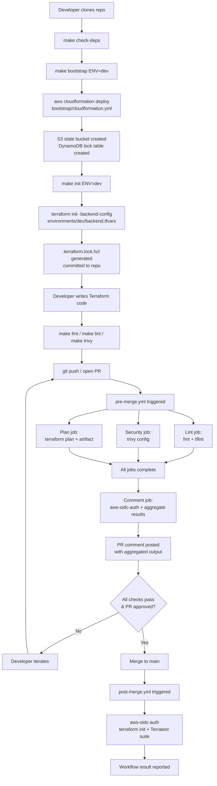

# Design Document: terraform-project-bootstrap

## Overview

This document describes the technical design for bootstrapping the `velocita` Terraform project repository. The goal is to produce a fully configured project skeleton — directories, version-pinning files, remote state configuration, a Makefile, GitHub Actions workflows with composite actions, a CloudFormation backend bootstrap template, and a Terratest scaffold — before any infrastructure-specific modules are written.

The bootstrap is a one-time setup operation. After it completes, every subsequent spec in the `velocita` project (S3/Glue, Firehose/Lambda, API Gateway) has a stable, consistent foundation to build on.

### Project Context

`velocita` is a serverless DORA-metrics pipeline for GitHub Actions. It captures CI/CD deployment events and computes Deployment Frequency, Lead Time for Changes, and Change Failure Rate using an API Gateway → Lambda → Firehose → S3 → Athena data path. This bootstrap spec is Spec 0 and is a hard prerequisite for Specs 1–4.

### Key Design Decisions

1. **Single `terraform/` root with shared `versions.tf` and `backend.tf`.** All environments share the same provider version constraints. Backend values are supplied per-environment via `-backend-config` flags rather than duplicated in HCL, so there is one `backend.tf` pattern and two `backend.tfvars` files.

2. **CloudFormation for the bootstrap S3/DynamoDB resources, not Terraform.** Terraform cannot manage its own remote state backend with Terraform itself — you need something else to create the S3 bucket and DynamoDB table first. CloudFormation is the natural AWS-native choice and avoids a chicken-and-egg dependency.

3. **GitHub Actions CI Only, no local pre-commit hooks.** All code quality checks (lint, security, trivy) run via GitHub Actions CI/CD to eliminate the overhead of maintaining dual local pre-commit hooks and CI validation. Developers run `make fmt`, `make lint`, and `make trivy` locally before pushing; CI enforces the same checks before merge.

4. **OIDC authenticationuthentication — no stored AWS credentials anywhere.** Both CI workflows use GitHub's OIDC token to assume a short-lived IAM role. No AWS access keys are stored in GitHub secrets or committed to the repository.

5. **`make apply` is manual — CI never runs `terraform apply` automatically.** The post-merge workflow runs `terraform init` and the Terratest suite, but all applies are gated behind a human decision via `make apply`.

6. **Composite actions encapsulate reusable CI steps.** The two workflows share the OIDC auth and Terraform setup steps through composite actions under `.github/actions/`, keeping workflow files DRY and ensuring both workflows always use identical versions and configuration.

---

## Architecture

### End-to-End Flow

The diagram below shows the relationship between the bootstrap components and the order in which a developer interacts with them.



**Workflow timing:**
- Pre-merge validation jobs (`lint`, `security`, `plan`) execute in parallel, minimizing feedback latency.
- The `comment` job waits for all three validation jobs to complete, then posts a single aggregated PR comment.
- Post-merge verification runs sequentially and halts on first failure.

### Component Interaction Map

```
velocita/
├── bootstrap/cloudformation.yml          ← Provisions S3 + DynamoDB (one-time)
│                                              ↓ outputs
├── terraform/environments/{env}/
│   ├── backend.tfvars                    ← Consumes CloudFormation outputs
│   └── terraform.tfvars                  ← Environment variable overrides
│
├── terraform/
│   ├── backend.tf                        ← S3 backend type declaration
│   ├── versions.tf                       ← Shared provider + Terraform version constraints
│   └── modules/                          ← Reusable modules (populated by Specs 1–4)
│
├── .tflint.hcl                           ← tflint AWS plugin config
├── .trivyignore.yaml                     ← trivy exception rules
├── Makefile                              ← Developer workflow entrypoint
│
├── .github/
│   ├── actions/
│   │   ├── setup-terraform/action.yml    ← Composite: install Terraform + init
│   │   └── aws-oidc-auth/action.yml      ← Composite: assume OIDC IAM role
│   ├── workflows/
│   │   ├── pre-merge.yml                 ← Multi-job: lint | security | plan → comment
│   │   └── post-merge.yml                ← Single job: init + Terratest suite
│   └── dependabot.yml                    ← Weekly GH Actions version updates
│
└── terraform/test/
    ├── go.mod                            ← Terratest dependency pinning
    ├── go.sum
    └── bootstrap_test.go                 ← Example test scaffold
```

---

## Components and Interfaces

### 1. Directory Structure and Tracked Placeholder Files

Every directory that must be committed to the repository without containing real content uses a `.gitkeep` file. The `.gitignore` is configured to ensure `.gitkeep` files are never accidentally excluded.

**Files created:**
- `terraform/modules/.gitkeep`
- `terraform/environments/dev/.gitkeep`
- `terraform/environments/prod/.gitkeep`

The root `README.md` documents:
- Repository directory structure overview
- Purpose of `terraform/modules/` and `terraform/environments/`
- Contributor onboarding steps: tool installation (`make check-deps`), first-time backend bootstrap (`make bootstrap ENV=dev`), and `make init ENV=dev`
- How to run the test suite (`make test`)

### 2. Editor and VCS Configuration Files

**`.gitattributes`**

Ensures consistent line endings and correct GitHub language detection:

```
*.tf         text eol=lf
*.tfvars     text eol=lf
*.hcl        text eol=lf
.terraform.lock.hcl  linguist-generated=true
tfplan-*     binary
```

**`.editorconfig`**

Enforces consistent formatting across editors:

```ini
root = true

[*]
indent_style = space
end_of_line = lf
charset = utf-8
trim_trailing_whitespace = true
insert_final_newline = true

[*.{tf,tfvars,yml,yaml,json}]
indent_size = 2
```

**`.gitignore`**

```
.terraform/
tfplan-*
*.auto.tfvars
crash.log
.terraform.tfstate
.terraform.tfstate.backup
```

### 3. Terraform Provider Version Pinning (`terraform/versions.tf`)

```hcl
terraform {
  required_version = "~> 1.9"

  required_providers {
    aws = {
      source  = "hashicorp/aws"
      version = "~> 5.0"
    }
  }
}
```

**Design decision:** `~> 5.0` on the AWS provider allows any `5.x` patch or minor version but rejects the `6.x` line until explicitly upgraded. This prevents surprise breaking changes while still picking up security fixes automatically during `terraform init -upgrade`.

The `.terraform.lock.hcl` file is committed to version control and records exact provider checksums. It is regenerated with `terraform providers lock -platform=linux_amd64 -platform=darwin_amd64 -platform=darwin_arm64` to cover the CI runner (Linux) and common developer machines (Intel/ARM Mac).

### 4. Remote State Backend Configuration

**`terraform/backend.tf`** (shared, checked in):
```hcl
terraform {
  backend "s3" {}
}
```

The backend is declared with an empty configuration body. All values are injected via `-backend-config` at `terraform init` time, so no credentials, account IDs, or environment-specific values are hardcoded in the checked-in file.

**`terraform/environments/dev/backend.tfvars`**:
```hcl
bucket         = "velocita-dev-terraform-state"
dynamodb_table = "velocita-dev-terraform-locks"
region         = "eu-west-1"
key            = "dev/terraform.tfstate"
```

**`terraform/environments/prod/backend.tfvars`**:
```hcl
bucket         = "velocita-prod-terraform-state"
dynamodb_table = "velocita-prod-terraform-locks"
region         = "eu-west-1"
key            = "prod/terraform.tfstate"
```

**Naming convention:** `<ProjectName>-<Environment>-terraform-state` and `<ProjectName>-<Environment>-terraform-locks`. These names align with what the CloudFormation bootstrap template generates, so the values in `backend.tfvars` directly match the CloudFormation stack outputs.

**`terraform/environments/dev/terraform.tfvars`** and **`terraform/environments/prod/terraform.tfvars`**: Empty placeholder files committed to indicate the intended location for future variable overrides.

### 4. Makefile


The Makefile is the single entrypoint for all developer commands. It uses an `ENV` variable to select the target environment and validates that required variables are set before executing destructive or environment-scoped commands.

**Key implementation patterns:**

```makefile
init: check-env
	terraform -chdir=$(TERRAFORM_DIR) init \
	  -backend-config=environments/$(ENV)/backend.tfvars

plan: check-env
	terraform -chdir=$(TERRAFORM_DIR) plan \
	  -var-file=environments/$(ENV)/terraform.tfvars \
	  -out=../tfplan-$(ENV)

apply: check-env
	@if [ ! -f tfplan-$(ENV) ]; then \
		echo "ERROR: Plan file tfplan-$(ENV) not found. Run 'make plan ENV=$(ENV)' first."; \
		exit 1; \
	fi
	terraform -chdir=$(TERRAFORM_DIR) apply ../tfplan-$(ENV)

fmt:
	terraform -chdir=$(TERRAFORM_DIR) fmt -recursive

lint:
	tflint --chdir=$(TERRAFORM_DIR) --recursive

trivy:
	trivy config $(TERRAFORM_DIR) --severity=HIGH,CRITICAL --ignorefile=.trivyignore.yaml

test:
	cd $(TEST_DIR) && go test -v -timeout 30m ./...

bootstrap: check-env
	aws cloudformation deploy \
	  --stack-name velocita-$(ENV)-bootstrap \
	  --template-file bootstrap/cloudformation.yml \
	  --parameter-overrides Environment=$(ENV) ProjectName=velocita \
	  --capabilities CAPABILITY_NAMED_IAM

check-deps:
	@echo "Checking dependencies..."
	@# Verify terraform, aws, tflint, trivy, go, jq binaries

clean:
	@echo "Cleaning auto-generated files..."
	@rm -rf $(TERRAFORM_DIR)/.terraform
	@rm -f tfplan-*
	@find $(TERRAFORM_DIR) -name ".terraform.lock.hcl" -type f -delete
	@cd $(TEST_DIR) && go clean
	@rm -f $(TEST_DIR)/*.out $(TEST_DIR)/*.test $(TEST_DIR)/*.cover
	@rm -f $(TEST_DIR)/go.work.sum
	@rm -f $(TEST_DIR)/coverage.out $(TEST_DIR)/coverage.html
```

**`make check-deps` design:** The target verifies the presence of required binaries (`terraform`, `aws`, `tflint`, `trivy`, `go`, `jq`) using `command -v` and prints a `✓` or `✗` line for each. It exits non-zero if any binary is missing.

**`make clean` design:** The target removes all auto-generated files and build artifacts:
- `.terraform/` directories (Terraform working directories)
- `tfplan-*` files (Terraform plan output)
- `.terraform.lock.hcl` files (provider lock files)
- Go build artifacts (via `go clean` and removal of `*.test`, `*.out`, `*.cover` files)
- `go.work.sum` (Go workspace lock)
- `coverage.out` and `coverage.html` (test coverage reports)

After running `make clean`, developers can re-run `make init ENV=<env>` to re-initialize the project.

**`make test` working directory:** The `test` target runs `go test` from within the `terraform/test/` directory so Go module resolution finds `go.mod` in the right location.

### 5. GitHub Actions Composite Actions

#### `.github/actions/aws-oidc-auth/action.yml`

Encapsulates GitHub OIDC authentication. Called by both pre-merge and post-merge workflows.

```yaml
name: AWS OIDC Auth
description: Authenticate to AWS using GitHub OIDC

inputs:
  role-arn:
    description: IAM role ARN to assume
    required: true
  aws-region:
    description: AWS region
    required: true
    default: eu-west-1

runs:
  using: composite
  steps:
    - name: Configure AWS credentials via OIDC
      uses: aws-actions/configure-aws-credentials@v4
      with:
        role-to-assume: ${{ inputs.role-arn }}
        aws-region: ${{ inputs.aws-region }}
        role-session-name: GitHubActions-${{ github.run_id }}
```

**Design decision:** The action takes `role-arn` and `aws-region` as inputs so it is reusable across environments and roles (read-only for plan, potentially a different role in future for apply). The `role-session-name` includes `github.run_id` to make CloudTrail audit logs unambiguous.

#### `.github/actions/setup-terraform/action.yml`

Installs Terraform at the pinned version and runs `terraform init`.

```yaml
name: Setup Terraform
description: Install Terraform and run init for a given environment

inputs:
  environment:
    description: Target environment (dev, prod)
    required: true
    default: dev
  tool-versions-file:
    description: Path to the .tool-versions file containing the pinned terraform version
    required: false
    default: .tool-versions

outputs:
  terraform-version:
    description: The Terraform version that was installed
    value: ${{ steps.version.outputs.terraform_version }}

runs:
  using: composite
  steps:
    - name: Read pinned Terraform version
      id: version
      shell: bash
      run: |
        VERSION=$(grep -E '^terraform[[:space:]]' "${{ inputs.tool-versions-file }}" | awk '{print $2}')
        if [ -z "$VERSION" ]; then
          echo "ERROR: Could not find a 'terraform' entry in ${{ inputs.tool-versions-file }}" >&2
          exit 1
        fi
        echo "terraform_version=$VERSION" >> "$GITHUB_OUTPUT"

    - name: Setup Terraform
      id: setup
      uses: hashicorp/setup-terraform@v3
      with:
        terraform_version: ${{ steps.version.outputs.terraform_version }}
        terraform_wrapper: true

    - name: Terraform Init
      shell: bash
      working-directory: terraform
      run: |
        terraform init \
          -backend-config=environments/${{ inputs.environment }}/backend.tfvars
```

**Design decision:** `terraform_wrapper: true` is required so that the `hashicorp/setup-terraform` action captures stdout/stderr from Terraform commands and makes them available as step outputs — this is a prerequisite for `GetTerminus/terraform-pr-commenter` to pick up the plan output.

**Design decision — version resolution:** `hashicorp/setup-terraform@v3` does not support a `terraform_version_file` input; it only accepts an explicit `terraform_version` string (or `latest`/a constraint). Since the project pins its Terraform version in `.tool-versions` (asdf format: `terraform 1.9.8`) rather than a dedicated `.terraform-version` file, the composite action reads and parses `.tool-versions` itself in a `Read pinned Terraform version` step, then passes the extracted version string into `hashicorp/setup-terraform@v3`'s `terraform_version` input. This keeps a single source of truth for the pinned version (`.tool-versions`, also used by local `asdf` installs) rather than duplicating the version number in the workflow file.
>
> **Fix history:** An earlier version of this action passed a `terraform_version_file` input pointing at a nonexistent `.terraform-version` file. Because `hashicorp/setup-terraform@v3` has no such input, it was silently ignored — the action installed `latest` instead of the pinned `1.9.8`, and the composite action's own `terraform-version` output was wired to a `steps.setup.outputs.terraform_version` value that the underlying action also never produced. Both issues are fixed by resolving the version locally from `.tool-versions` before calling the upstream action.

### 6. GitHub Actions Workflows

#### `.github/workflows/pre-merge.yml` — Multi-Job Architecture

Triggered on `pull_request` events targeting `main`. Never runs `terraform apply`.

The pre-merge workflow uses a four-job architecture to minimize feedback latency:

```yaml
name: Pre-Merge Validation

on:
  pull_request:
    branches: [main]

permissions:
  contents: read
  id-token: write
  pull-requests: write

env:
  ENV: dev

jobs:
  lint:
    runs-on: ubuntu-latest
    steps:
      - uses: actions/checkout@v4

      - name: AWS OIDC Auth (read-only)
        uses: ./.github/actions/aws-oidc-auth
        with:
          role-arn: ${{ vars.AWS_PLAN_ROLE_ARN }}
          aws-region: ${{ vars.AWS_REGION }}

      - name: Setup Terraform + Init
        uses: ./.github/actions/setup-terraform
        with:
          environment: ${{ env.ENV }}

      - name: Terraform Format Check
        id: fmt
        working-directory: terraform
        run: terraform fmt -check -recursive

      - name: tflint
        id: tflint
        working-directory: terraform
        run: tflint --recursive

  security:
    runs-on: ubuntu-latest
    steps:
      - uses: actions/checkout@v4

      - name: Trivy Config Scan
        id: trivy
        uses: aquasecurity/trivy-action@v0.30.0
        with:
          scan-type: config
          scan-ref: terraform/
          severity: HIGH,CRITICAL
          exit-code: '1'

  plan:
    runs-on: ubuntu-latest
    outputs:
      plan-summary: ${{ steps.plan.outputs.stdout }}
    steps:
      - uses: actions/checkout@v4

      - name: AWS OIDC Auth (read-only)
        uses: ./.github/actions/aws-oidc-auth
        with:
          role-arn: ${{ vars.AWS_PLAN_ROLE_ARN }}
          aws-region: ${{ vars.AWS_REGION }}

      - name: Setup Terraform + Init
        uses: ./.github/actions/setup-terraform
        with:
          environment: ${{ env.ENV }}

      - name: Terraform Plan
        id: plan
        working-directory: terraform
        run: |
          terraform plan \
            -var-file=environments/${{ env.ENV }}/terraform.tfvars \
            -out=../tfplan-${{ env.ENV }} \
            -no-color

      - name: Store Plan Artifact
        uses: actions/upload-artifact@v4
        with:
          name: tfplan-${{ env.ENV }}
          path: tfplan-${{ env.ENV }}
          retention-days: 1

  comment:
    runs-on: ubuntu-latest
    needs: [lint, security, plan]
    if: always()
    steps:
      - uses: actions/checkout@v4

      - name: Download Plan Artifact
        uses: actions/download-artifact@v4
        with:
          name: tfplan-${{ env.ENV }}

      - name: Post PR Comment
        uses: GetTerminus/terraform-pr-commenter@v3
        with:
          commenter_type: plan
          commenter_input: ${{ needs.plan.outputs.plan-summary }}
          commenter_exitcode: ${{ needs.plan.result == 'failure' && '1' || (needs.lint.result == 'failure' && '1' || (needs.security.result == 'failure' && '1' || '0')) }}
        env:
          GITHUB_TOKEN: ${{ secrets.GITHUB_TOKEN }}
          TF_WORKSPACE: ${{ env.ENV }}

      - name: Fail if any job failed
        if: >
          needs.lint.result == 'failure' ||
          needs.security.result == 'failure' ||
          needs.plan.result == 'failure'
        run: exit 1
```

**Job Design:**

- **`lint` job**: Runs `terraform fmt -check` and `tflint` in sequence within the same job. Both must pass for the job to succeed. Runs in parallel with `security` and `plan` jobs. Exits non-zero if either check fails.

- **`security` job**: Runs `trivy config` scan. Severity threshold is `HIGH,CRITICAL`. Exits non-zero if any findings are detected. Runs in parallel with `lint` and `plan` jobs.

- **`plan` job**: Runs `terraform plan`, stores the plan file as a GitHub Actions artifact (1-day retention for manual apply workflows), and exports the plan summary as a job output for the `comment` job to consume. Runs in parallel with `lint` and `security` jobs.

- **`comment` job**: Depends on `lint`, `security`, and `plan` jobs via `needs: [lint, security, plan]`. Uses `if: always()` to ensure it runs even if any upstream job fails. Downloads the plan artifact, aggregates results from all three jobs, and posts a single PR comment using `GetTerminus/terraform-pr-commenter@v3`. Fails the workflow if any upstream job failed.

**Design decisions:**

- **Parallel execution**: The three validation jobs (`lint`, `security`, `plan`) run concurrently to minimize total workflow execution time.
- **Composite job dependencies**: The `comment` job depends on all three validation jobs and always runs (via `if: always()`) so that failures are always surfaced in the PR.
- **Plan artifact storage**: The `plan` job uploads the plan file as an artifact with 1-day retention. This allows manual `terraform apply` operations via a future `apply-via-artifact` workflow without re-running the plan.
- **Job output export**: The `plan` job exports `plan-summary` as a job output so the `comment` job can consume it without downloading and re-parsing the artifact.
- **Repository variables, not secrets**: The workflow uses `${{ vars.AWS_PLAN_ROLE_ARN }}` (a GitHub repository variable, not a secret). Role ARNs are non-sensitive resource identifiers and are safe to log and view in workflow runs. Temporary AWS credentials (STS access keys, secret keys, and session tokens) generated by OIDC are never exposed.
- **Major version pinning**: All GitHub Actions are pinned to their major version (e.g., `@v4`, `@v3`) to balance stability and security updates.

#### `.github/workflows/post-merge.yml`

Triggered on `push` to `main`. Runs `terraform init` and the Terratest suite. Never runs `terraform apply`.

```yaml
name: Post-Merge Verification

on:
  push:
    branches: [main]

permissions:
  contents: read
  id-token: write

env:
  ENV: dev

jobs:
  verify:
    runs-on: ubuntu-latest
    steps:
      - uses: actions/checkout@v4

      - name: AWS OIDC Auth (read-only)
        uses: ./.github/actions/aws-oidc-auth
        with:
          role-arn: ${{ vars.AWS_INIT_ROLE_ARN }}
          aws-region: ${{ vars.AWS_REGION }}

      - name: Setup Terraform + Init
        uses: ./.github/actions/setup-terraform
        with:
          environment: ${{ env.ENV }}

      - name: Setup Go
        uses: actions/setup-go@v5
        with:
          go-version-file: terraform/test/go.mod
          cache-dependency-path: terraform/test/go.sum

      - name: Run Terratest Suite
        working-directory: terraform/test
        run: go test -v -timeout 30m ./...
        env:
          AWS_REGION: ${{ vars.AWS_REGION }}
```

**Design decisions:**

- **Single-job architecture**: Unlike the pre-merge workflow, the post-merge workflow uses a single sequential job. Steps halt on first failure (no `continue-on-error`), ensuring early termination if initialization fails.
- **Read-only OIDC role**: Uses `${{ vars.AWS_INIT_ROLE_ARN }}` (a GitHub repository variable) to assume a read-only IAM role sufficient for `terraform init` and test operations. This role is separate from `AWS_PLAN_ROLE_ARN` to allow fine-grained permission control.
- **Repository variables, not secrets**: Both pre-merge and post-merge workflows use repository variables (`vars.AWS_PLAN_ROLE_ARN`, `vars.AWS_INIT_ROLE_ARN`, `vars.AWS_REGION`) rather than secrets. Role ARNs and region names are non-sensitive resource identifiers and are safe to log and view in workflow runs.

#### `.github/dependabot.yml`

```yaml
version: 2
updates:
  - package-ecosystem: github-actions
    directory: /
    schedule:
      interval: weekly
    open-pull-requests-limit: 5
```

### 7. CloudFormation Backend Bootstrap (`bootstrap/cloudformation.yml`)

Creates exactly two resources: the S3 state bucket and the DynamoDB lock table. This template is idempotent (`aws cloudformation deploy` performs a create-or-update).

```yaml
AWSTemplateFormatVersion: '2010-09-09'
Description: >
  Terraform remote state backend resources for the velocita project.
  Creates an S3 bucket for state storage and a DynamoDB table for state locking.

Parameters:
  Environment:
    Type: String
    AllowedValues: [dev, prod]
    Description: Deployment environment

  ProjectName:
    Type: String
    Default: velocita
    Description: Project name used as a prefix for all resource names

Resources:
  TerraformStateBucket:
    Type: AWS::S3::Bucket
    Properties:
      BucketName: !Sub "${ProjectName}-${Environment}-terraform-state"
      VersioningConfiguration:
        Status: Enabled
      BucketEncryption:
        ServerSideEncryptionConfiguration:
          - ServerSideEncryptionByDefault:
              SSEAlgorithm: AES256
      PublicAccessBlockConfiguration:
        BlockPublicAcls: true
        BlockPublicPolicy: true
        IgnorePublicAcls: true
        RestrictPublicBuckets: true

  TerraformLockTable:
    Type: AWS::DynamoDB::Table
    Properties:
      TableName: !Sub "${ProjectName}-${Environment}-terraform-locks"
      BillingMode: PAY_PER_REQUEST
      AttributeDefinitions:
        - AttributeName: LockID
          AttributeType: S
      KeySchema:
        - AttributeName: LockID
          KeyType: HASH

Outputs:
  StateBucketName:
    Value: !Ref TerraformStateBucket
    Export:
      Name: !Sub "${ProjectName}-${Environment}-terraform-state-bucket"

  LockTableName:
    Value: !Ref TerraformLockTable
    Export:
      Name: !Sub "${ProjectName}-${Environment}-terraform-lock-table"
```

**Design decisions:**
- `BucketName` is deterministic and matches the naming pattern used in `backend.tfvars`. This lets a developer copy the CloudFormation output directly into their backend config.
- S3 versioning is enabled so that previous state files can be recovered after accidental corruption or a bad apply.
- AES-256 (SSE-S3) is used rather than KMS to avoid key management overhead at the bootstrap stage. KMS can be layered on by a later spec if required.
- DynamoDB uses `PAY_PER_REQUEST` billing. State lock acquisitions are infrequent (a few per developer per day), so provisioned capacity would be wasted spend.

### 8. Terratest Scaffold (`terraform/test/`)

**`terraform/test/go.mod`**:

```
module github.com/velocita/terraform-test

go 1.27

require (
    github.com/gruntwork-io/terratest v0.46.16
    github.com/stretchr/testify v1.9.0
)
```

**`terraform/test/bootstrap_test.go`** (example test stub):

```go
package test

import (
    "testing"

    "github.com/gruntwork-io/terratest/modules/terraform"
    "github.com/stretchr/testify/assert"
)

// TestBootstrapModuleExists verifies that the Terraform configuration
// in the terraform/ directory is syntactically valid and can be initialised
// without errors. This test does NOT deploy any real infrastructure.
func TestBootstrapModuleExists(t *testing.T) {
    t.Parallel()

    terraformOptions := &terraform.Options{
        TerraformDir: "../",
        NoColor:      true,
    }

    // Validate runs `terraform validate` which checks syntax and internal
    // consistency without requiring a backend or provider credentials.
    out, err := terraform.ValidateE(t, terraformOptions)
    assert.NoError(t, err, "terraform validate failed: %s", out)
}
```

**Design decision:** The scaffold test exercises `terraform validate` rather than deploying real infrastructure. This keeps CI fast and free, while confirming that the HCL is syntactically valid and all referenced variables are declared. Integration tests that provision real AWS resources are added incrementally by later specs.

---

## Data Models

This section captures the key configuration schemas and naming conventions used across components.

### Resource Naming Convention

All AWS resources follow the pattern `{ProjectName}-{Environment}-{ResourceType}`:

| Resource | Dev name | Prod name |
|---|---|---|
| S3 state bucket | `velocita-dev-terraform-state` | `velocita-prod-terraform-state` |
| DynamoDB lock table | `velocita-dev-terraform-locks` | `velocita-prod-terraform-locks` |
| CloudFormation stack | `velocita-dev-bootstrap` | `velocita-prod-bootstrap` |
| Terraform state key | `dev/terraform.tfstate` | `prod/terraform.tfstate` |

### Environment Variable Schema (`ENV`)

The `ENV` Makefile variable is the single selector for all environment-scoped operations. Valid values at bootstrap time: `dev`, `prod`. It maps to:

- The backend config file: `terraform/environments/${ENV}/backend.tfvars`
- The variable file: `terraform/environments/${ENV}/terraform.tfvars`
- The plan output file: `tfplan-${ENV}` (in the repo root, git-ignored)
- The CloudFormation stack name: `velocita-${ENV}-bootstrap`

### Terraform Backend Config Schema

Each `backend.tfvars` file contains exactly these keys (no credentials, no account IDs):

| Key | Type | Example |
|---|---|---|
| `bucket` | string | `velocita-dev-terraform-state` |
| `dynamodb_table` | string | `velocita-dev-terraform-locks` |
| `region` | string | `eu-west-1` |
| `key` | string | `dev/terraform.tfstate` |

### GitHub Actions Variable Schema

Required GitHub Actions variables (stored as **repository variables**, not secrets — these are non-sensitive configuration):

| Variable name | Example value | Used by | Notes |
|---|---|---|---|
| `AWS_PLAN_ROLE_ARN` | `arn:aws:iam::123456789012:role/velocita-github-plan` | Pre-merge workflow | ARN is a non-sensitive resource identifier, safe to log |
| `AWS_INIT_ROLE_ARN` | `arn:aws:iam::123456789012:role/velocita-github-init` | Post-merge workflow | ARN is a non-sensitive resource identifier, safe to log |
| `AWS_REGION` | `eu-west-1` | Both workflows, Terratest | Region name is non-sensitive configuration |

**Important security note:** No AWS credentials (access keys, secret keys, or session tokens) are stored as secrets. The OIDC mechanism provides ephemeral STS credentials at runtime, which are never exposed in logs or outputs. Only resource identifiers (ARNs, region names) and non-sensitive configuration are stored as repository variables.

### Complete Repository File Manifest

```
velocita/
├── .editorconfig
├── .gitattributes
├── .gitignore
├── .tool-versions
├── .trivyignore.yaml
├── LICENSE
├── Makefile
├── README.md
│
├── bootstrap/
│   └── cloudformation.yml
│
├── terraform/
│   ├── backend.tf
│   ├── versions.tf
│   ├── .terraform.lock.hcl            ← generated, committed
│   ├── environments/
│   │   ├── dev/
│   │   │   ├── .gitkeep
│   │   │   ├── backend.tfvars
│   │   │   └── terraform.tfvars
│   │   └── prod/
│   │       ├── .gitkeep
│   │       ├── backend.tfvars
│   │       └── terraform.tfvars
│   ├── modules/
│   │   └── .gitkeep
│   └── test/
│       ├── go.mod
│       ├── go.sum
│       └── bootstrap_test.go
│
├── .github/
│   ├── actions/
│   │   ├── aws-oidc-auth/
│   │   │   └── action.yml
│   │   └── setup-terraform/
│   │       └── action.yml
│   ├── workflows/
│   │   ├── pre-merge.yml
│   │   └── post-merge.yml
│   └── dependabot.yml
│
└── .tflint.hcl
```

---

## Correctness Properties

This spec delivers declarative configuration files and shell-level tooling rather than pure functions. The correctness properties below are expressed as invariants — conditions that must hold true at all times — and are validated through the testing layers described in the Testing Strategy section.

### Property 1: No Hardcoded Credentials
**Property:** No file committed to the repository SHALL contain an AWS access key ID, secret access key, session token, or account ID.
**Validated by:** `trivy config` scan run locally via `make trivy` and in the CI pre-merge workflow's `security` job; `tflint` AWS ruleset.
**Validates: Requirements 4.4**

### Property 2: Backend Config Completeness
**Property:** Every `backend.tfvars` file SHALL contain all four required keys (`bucket`, `dynamodb_table`, `region`, `key`) and no credentials.
**Validated by:** `TestBackendConfigCompleteness` in the Terratest suite — parses each `backend.tfvars` file and asserts all required keys are present.
**Validates: Requirements 4.2**

### Property 3: Terraform Configuration Validity
**Property:** `terraform validate` SHALL exit 0 on the `terraform/` directory at all times.
**Validated by:** `TestBootstrapModuleExists` in the Terratest suite runs `terraform.ValidateE` on every `make test` / CI post-merge run.
**Validates: Requirements 3.1, 3.2**

### Property 4: Provider Lock File Consistency
**Property:** The `.terraform.lock.hcl` file SHALL be present and SHALL contain a checksum entry for the `hashicorp/aws` provider.
**Validated by:** `TestLockFilePresent` in the Terratest suite — checks file existence and parses for the provider entry.
**Validates: Requirements 3.4**

### Property 6: CloudFormation Template Schema Validity
**Property:** `bootstrap/cloudformation.yml` SHALL be a valid CloudFormation template that passes schema validation.
**Validated by:** `aws cloudformation validate-template` invoked by `make bootstrap`; CloudFormation rejects invalid templates before creating any resources.
**Validates: Requirements 9.1**

### Property 7: Idempotent Bootstrap
**Property:** Running `make bootstrap ENV=dev` twice in succession SHALL result in the same CloudFormation stack state (`CREATE_COMPLETE` or `UPDATE_COMPLETE`) with no resource replacement.
**Validated by:** Manual verification during initial setup; `aws cloudformation deploy` is idempotent by design.
**Validates: Requirements 9.7**

---

## Error Handling

### `make` Guard Conditions

| Condition | Behaviour |
|---|---|
| `ENV` not set for `init`, `plan`, `apply`, `bootstrap` | Print `ERROR: ENV is not set. Usage: make <target> ENV=<env>` and exit 1 |
| `tfplan-${ENV}` missing when `make apply` is called | Print `ERROR: Plan file tfplan-${ENV} not found. Run 'make plan ENV=<env>' first.` and exit 1 |
| Required binary missing from `make check-deps` | Print `✗ <binary> not found` for each missing binary; exit 1 after checking all |

### Local Quality Checks

There are no local pre-commit hooks. Developers run `make fmt`, `make lint`, and `make trivy` manually before pushing. The same checks are enforced again by the pre-merge CI workflow, so a skipped local check is still caught before merge.

| Command | What it checks | Failure output | Resolution |
|---|---|---|---|
| `make fmt` | Formatting consistency | Lists files requiring reformatting | Re-run `make fmt` to auto-fix |
| `make lint` | Style, correctness, deprecated resources, AWS-specific rules | Lists rule violations with file/line references | Fix the flagged Terraform code |
| `make trivy` | Security misconfigurations in Terraform HCL | Lists HIGH/CRITICAL findings with CVE IDs | Address the security misconfiguration or add an exception to `.trivyignore.yaml` |

### CI Workflow Failures

**Pre-merge:** The pre-merge workflow uses a multi-job architecture where `lint`, `security`, and `plan` jobs run in parallel. Each job fails independently if its checks fail. The `comment` job depends on all three jobs and uses `if: always()` to ensure it always runs, even when upstream jobs fail. This allows the PR comment to aggregate and surface all failures in a single comment, giving the developer a complete picture without requiring multiple push-retry cycles.

**Post-merge:** Steps run sequentially without `continue-on-error`. The first failure halts the workflow immediately. This is intentional — there is no value in running the Terratest suite if `terraform init` fails.

### DynamoDB State Lock Handling

If a `terraform apply` or `terraform plan` is interrupted while holding a DynamoDB lock, the lock entry persists in the table. Recovery is manual:

```bash
terraform -chdir=terraform force-unlock <lock-id>
```

The lock ID appears in the error message when Terraform detects an existing lock. No automated lock-clearing is implemented — this is a deliberate safety choice to prevent accidental concurrent applies.

### CloudFormation Bootstrap Error Handling

`aws cloudformation deploy` is idempotent. If the stack already exists and no parameters have changed, it exits with `UPDATE_COMPLETE` or reports that no changes are needed. If the template contains an error, CloudFormation rolls back automatically and `make bootstrap` exits non-zero, printing the stack events.

---

## Testing Strategy

### Why Property-Based Testing Does Not Apply

This spec delivers declarative configuration files, shell-level Makefile targets, YAML workflow definitions, and a CloudFormation template. None of these are pure functions with clear input/output semantics amenable to property-based testing:

- **Makefile targets** are side-effect-only operations (invoking Terraform, AWS CLI, Go toolchain). There is no return value to assert universal properties on.
- **GitHub Actions YAML** is declarative workflow configuration. Correctness is verified by the GitHub Actions runtime, not by a property test.
- **CloudFormation template** is declarative IaC. The correct test is a schema validation and snapshot test, not a property test.
- **`versions.tf`** correctness is checked by `terraform validate` and `terraform init`, not by property tests.

### Testing Layers

#### Layer 1: Static Analysis (local `make` targets + CI)

These checks are run manually by developers before pushing (`make fmt`, `make lint`, `make trivy`) and are re-run automatically on every PR (CI pre-merge workflow):

| Tool | What it checks | Failure means |
|---|---|---|
| `terraform fmt -check` | Formatting consistency | Run `make fmt` |
| `tflint --recursive` | Style, correctness, deprecated resources, AWS-specific rules | Fix the flagged code |
| `trivy config` (HIGH/CRITICAL) | Security misconfigurations in Terraform HCL | Address the CVE or suppress with justification |
| `terraform validate` | Syntax validity, missing variable declarations | Fix the HCL syntax |

#### Layer 2: Unit Tests — Terratest (example-based)

The Terratest suite in `terraform/test/` contains example-based tests that validate module behaviour without deploying real infrastructure. At bootstrap time, the suite contains one test:

**`TestBootstrapModuleExists`**
- Calls `terraform validate` against `terraform/`
- Asserts exit code 0 and no error output
- Purpose: confirms the HCL skeleton is valid and parseable before any modules are added

Future specs will add tests to this suite that use `terraform.InitAndPlan` with mocked provider credentials to validate module logic.

#### Layer 3: Smoke Tests (`make check-deps`)

`make check-deps` is a developer-environment smoke test:

- Verifies the presence of `terraform`, `aws`, `tflint`, `trivy`, `go`, `jq` on PATH
- Prints a summary line per check (`✓` or `✗`)
- Exits non-zero if any check fails

This target is documented as the first step in the README onboarding guide.

#### Layer 4: Integration Smoke (CI post-merge)

The post-merge workflow runs `terraform init` against a real S3 backend (after `make bootstrap` has been run once manually). This confirms:

- The S3 state bucket exists and is accessible via OIDC credentials
- The DynamoDB lock table exists
- Provider checksums in `.terraform.lock.hcl` are valid for the CI runner platform

This is a single-execution smoke test, not a property test. It runs on every merge to `main`.

#### Layer 5: CloudFormation Schema Validation

The CloudFormation template is validated using `cfn-lint` or `aws cloudformation validate-template` in a future CI hook. At bootstrap time, the template is validated manually as part of the `make bootstrap` workflow (CloudFormation rejects malformed templates before creating any resources).

### Manual Verification Checklist

After completing the bootstrap, a developer should verify:

1. `make check-deps` exits 0 with all checkmarks
2. `make bootstrap ENV=dev` creates the CloudFormation stack in `CREATE_COMPLETE` state
3. `make init ENV=dev` exits 0 and generates `.terraform.lock.hcl`
4. `make fmt` exits 0 (no formatting changes needed)
5. `make lint` exits 0
6. `make test` exits 0 (`TestBootstrapModuleExists` passes)
7. Opening a PR triggers the pre-merge workflow and posts a formatted PR comment
8. Merging to `main` triggers the post-merge workflow and the Terratest suite passes
9. `make clean` removes all auto-generated files and `make init ENV=dev` succeeds again afterward
